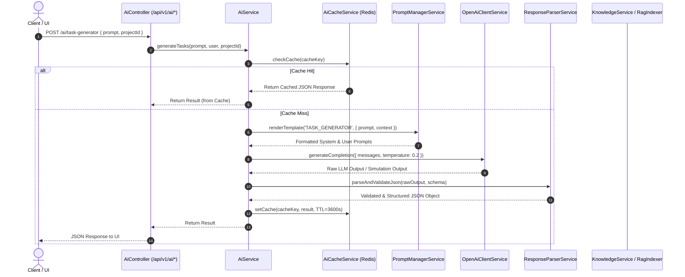
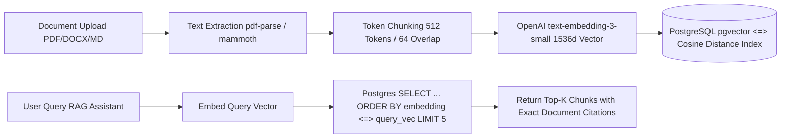

# TaskPilot AI — Decoupled AI Pipeline & RAG Indexer Architecture

TaskPilot AI incorporates a highly sophisticated, decoupled AI orchestration engine designed for low-latency copilot interactions, token window management, semantic vector indexing (`pgvector`), and high-fidelity deterministic simulation mode.

---

## 1. Decoupled AI Pipeline Diagram



---

## 2. RAG (Retrieval-Augmented Generation) Vector Indexing (`pgvector`)

When users upload PDF, DOCX, or Markdown engineering specifications to `/api/v1/knowledge`, the document pipeline processes text through the following stages:



### pgvector Operator Specification
In `RagIndexerService`, vector similarity search is executed using raw PostgreSQL `<=>` cosine distance operator:
```sql
SELECT id, "documentId", content, "chunkIndex",
       1 - (embedding <=> $1::vector) as similarity
FROM "KnowledgeChunk"
WHERE "documentId" IN ($2, $3...)
ORDER BY embedding <=> $1::vector
LIMIT 5;
```

---

## 3. Dual-Mode AI Client & Deterministic QA Simulation Mode

To support reliable, repeatable testing across Autonomous QA SUT workflows without incurring real API token charges or non-deterministic LLM variance, `OpenAiClientService` checks the `x-ai-simulation` request header or `OPENAI_SIMULATION_MODE=true` environment variable.

When enabled (`x-ai-simulation: true`):
- All 10 AI capabilities immediately return pre-computed, structured, realistic engineering responses.
- Eliminates network flakiness and rate limits during automated regression sweeps while maintaining exact JSON schemas.
