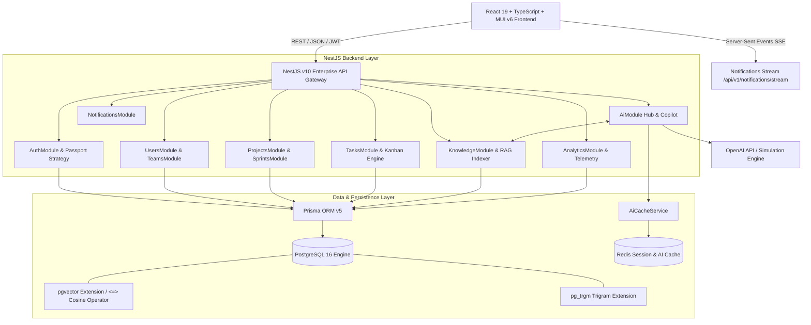

# TaskPilot AI — System Architecture & Topology

TaskPilot AI is designed as a modular, decoupled, enterprise-ready web application adhering to clean architecture principles and domain-driven design (`DDD`) boundaries.

---

## 1. High-Level Architecture Diagram

---

## 2. Backend Module Breakdown

- **`AppModule`**: Root wiring module registering global filters (`HttpExceptionFilter`), interceptors (`TransformInterceptor`, `LoggingInterceptor` with correlation ID injection), validation pipes (`ValidationPipe`), and Swagger (`/api/docs`).
- **`AuthModule`**: Passport JWT authentication with refresh token rotation and Redis blacklist checks. Enforces role boundaries via `@Roles()` decorator.
- **`ProjectsModule` & `SprintsModule`**: Workspace project management, team scopes, sprint lifecycle (`PLANNED`, `ACTIVE`, `CLOSED`), and velocity burndown calculations.
- **`TasksModule`**: High-performance Kanban swimlane engine with subtask checklists, priority tags, comments (`@username` mentions), and optimistic status updates.
- **`AiModule`**: Decoupled AI orchestration pipeline routing through caching, prompt engineering, schema validation, and OpenAI / local simulation endpoints.
- **`KnowledgeModule`**: RAG vector ingestion, chunking (`512 tokens`), and pgvector similarity indexing.
- **`AnalyticsModule` & `NotificationsModule`**: Executive KPI aggregations and real-time SSE live streaming.

---

## 3. Database Schema Overview (`Prisma ORM`)

The schema (`backend/prisma/schema.prisma`) enforces strict relational integrity across 12 primary models:
- **`User`** (`1:N` across `Team`, `Project`, `Task`, `Comment`, `ActivityLog`)
- **`Team` & `Project`** (`1:N` with `Epic` and `Sprint`)
- **`Epic` -> `Story` -> `Task` -> `Subtask` & `Comment`** (Full Agile hierarchy)
- **`KnowledgeDocument` -> `KnowledgeChunk`** (`pgvector` embedded chunks with `Unsupported("vector(1536)")` data type)
- **`AiPromptTemplate` & `AuditLog`** (Governance and auditability)
